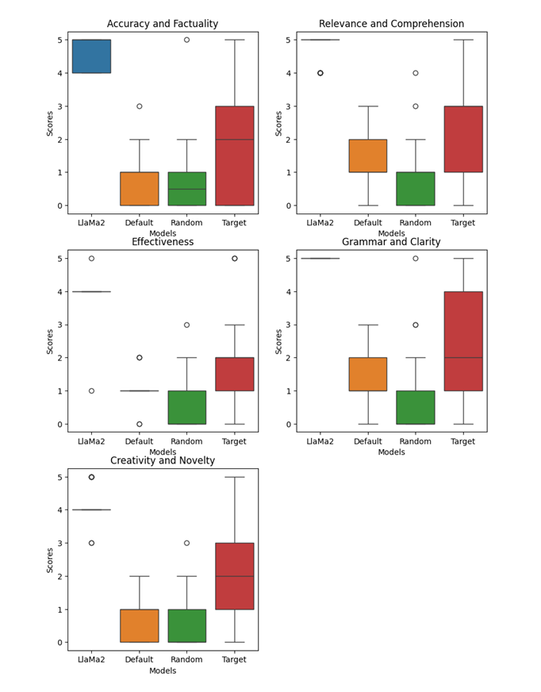
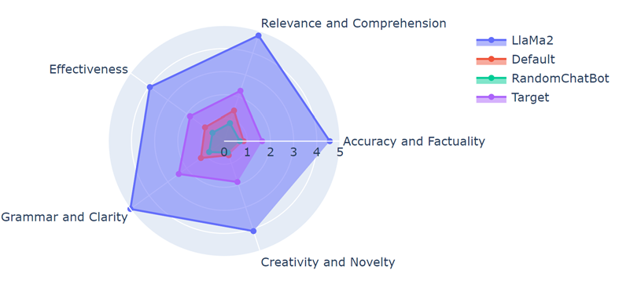

# FirstSportsELM
### The first ever Sports Expert Language Model

As avid sports enthusiasts, we’ve consistently observed a gap in the market for a dedicated
large language model tailored to the sports domain. This research stems from our intrigue
about the potential of a language model that is exclusively trained and fine-tuned on sports-
related data. We aim to assess its performance against generic language models, thus delving
into the unique nuances and demands of the sports industry

## Model Checkpoint File

https://drive.google.com/drive/folders/1PSYYWdUWiM5t0KTtlpwQ1YXBWRwV1JWi?usp=sharing

*put FineTune_ckpt.pt under model folder in finetune/model/ if you wish to proceed with inference*

## Pretrain Data 

https://drive.google.com/drive/folders/1bZvWxLnmCDYJhgMDaWumr33KbyDKQUki?usp=sharing

*train.bin ~8.4 Gb/4.5B tokens, val.bin ~4.1 Mb/2M tokens*

## Fine Tune Space
1. Generate Tags, Questions and Respones from GPT-4

*python FineTuneDataGeneration.py api_key Numtag NumQuestion NumParaphrase NumAnswer*

* api_key: Your Api Key
* Numtag: number of tags, default 50, optional
* NumQuestion: number of questions, default 16, optional   
* NumParaphrase: number of question paraphrases, default 1, optional  
* NumAnswer: number of answers, default 2, optional 

2. Convert Json to TXT and Bin for fine-tune

*python Json2Bin.py*

3. Fine Tune OmniSportsGPT

*python train.py FineTuneConfig.py*

## Ask Your Question!

1. Inference

*python Inference.py YourQuestionHere*

*python DefaultAnswer.py*

*python RandomGPT2ChatBot.py*

2. Plot Result

*python plot.py*

## Evaluation

