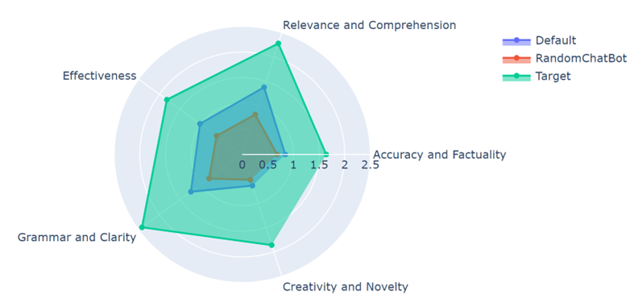

# FirstSportsELM
### The first ever Sports Expert Language Model
  Created by Chris Zexin Chen, Sean Xie, Chengxi Li.
  Email for question: zc2404@nyu.edu

As avid sports enthusiasts, we’ve consistently observed a gap in the market for a dedicated
large language model tailored to the sports domain. This research stems from our intrigue
about the potential of a language model that is exclusively trained and fine-tuned on sports-
related data. We aim to assess its performance against generic language models, thus delving
into the unique nuances and demands of the sports industry

This model structure is built by Andrej Karpathy: https://github.com/karpathy/nanoGPT

Here is a example QA from SportsDPT


## Model Checkpoint File

https://drive.google.com/drive/folders/1PSYYWdUWiM5t0KTtlpwQ1YXBWRwV1JWi?usp=sharing

*put FineTune_ckpt.pt under model folder in finetune/model/ if you wish to proceed with inference*

## Pretrain Data 

https://drive.google.com/drive/folders/1bZvWxLnmCDYJhgMDaWumr33KbyDKQUki?usp=sharing

## Pretrain
To replicate our model, you need to use train.bin and val.bin in this drive, which is processed and ready to train.
We trained on a 4xA100 40GB node for 30 hrs to get a val loss ~2.36. Once you set up the environment, run the following:

#```$ torchrun --standalone --nproc_per_node=8 train.py config/train_gpt2.py```


*train.bin ~8.4 Gb/4.5B tokens, val.bin ~4.1 Mb/2M tokens*

## Fine Tune Space
1. Generate Tags, Questions and Respones from GPT-4

*python FineTuneDataGeneration.py api_key Numtag NumQuestion NumParaphrase NumAnswer*

* api_key: Your Api Key
* Numtag: number of tags, default 50, optional
* NumQuestion: number of questions, default 16, optional   
* NumParaphrase: number of question paraphrases, default 1, optional  
* NumAnswer: number of answers, default 2, optional 

2. Convert Json to TXT and Bin for fine-tune

*python Json2Bin.py*

3. Fine Tune OmniSportsGPT

*python train.py FineTuneConfig.py*


## Ask Your Question!

1. Inference

*python Inference.py YourQuestionHere*

*python DefaultAnswer.py*

*python RandomGPT2ChatBot.py*

2. Plot Result

*python plot.py*

## Benchmark
  Target: Sports DPT
  
  Default: GPT2 replica finetuned by sports QA
  
  Random: GPT2 size language model finetuned by general QA
  
  Llama2: Llama2 7B finetuned by general QA
  



